# 📊 Quick Stats (Main Screen)

An Anki addon that replaces the default "Studied X cards in Y minutes today (Zs/card)" line on the main deck-browser screen with a clean, minimalist stat card that adapts to Anki's light/dark theme.

## Features

- **Total reviews (lifetime):** A big all-time review count (off by default).
- **Period stats row:** A small button that cycles through **Today / Last month / Last year / Lifetime**, showing whichever of these you enable for the selected period:
  - Cards studied
  - Time studied (minutes, switching to hours past 60 min)
  - Average time per card
  - New cards studied
  - Retention %
- **Future daily load:** Matches Anki's own Future Daily Load
- Optionally bring back Anki's original "Studied X cards..." line alongside the new card.
- A native settings dialog through "**Tools → Quick Stats Settings...**" (no manual JSON editing needed)

## Screenshots

**Before / after** - Replaces Anki's plain default line with a clean stat card:

| Before | After |
|---|---|
| 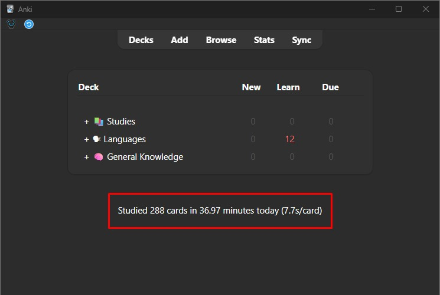 | 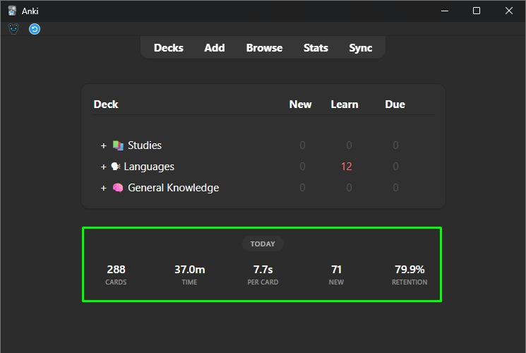 |

**Cycle through periods** - Click the button to switch what the row shows:

| Today | Last month | Last year | Lifetime |
|---|---|---|---|
| 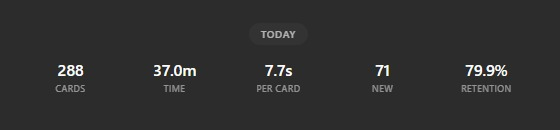 | 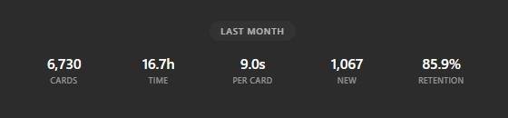 | 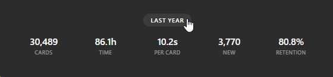 | 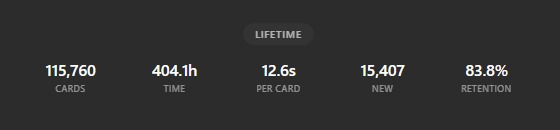 |

**Settings dialog** - No manual config editing required:

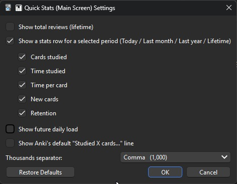

**Pick exactly which stats show up** - Here only Cards, Time, and Per card are enabled:

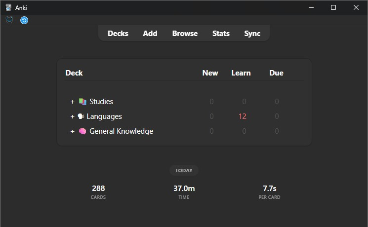

**Combine sections freely** - Example using total reviews + period row + future row together:

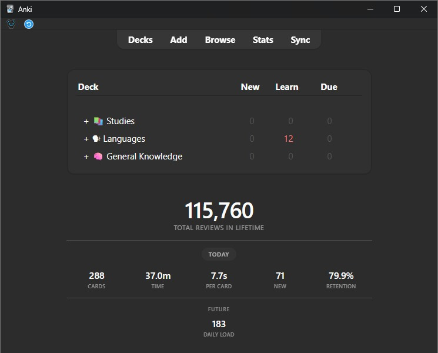

**Keep Anki's original line too**, if you just want to add to it rather than replace it:

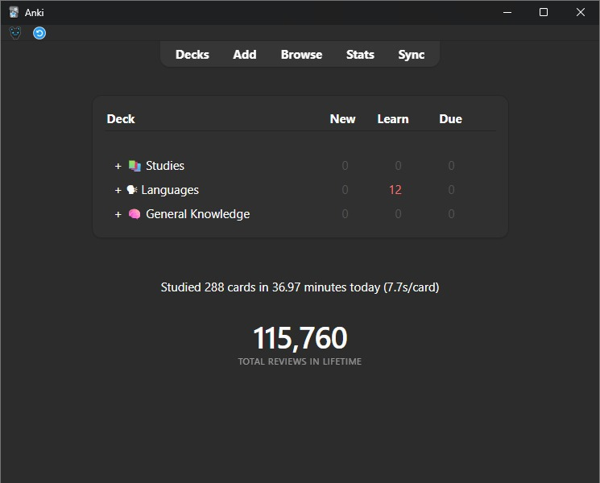

**Visualization with other addons: [Review Heatmap](https://ankiweb.net/shared/info/1771074083) and [Cat Study Buddy](https://ankiweb.net/shared/info/94808647)** - These three sit together nicely on the main screen:

| Heatmap | Heatmap + Cat Study Buddy |
|---|---|
| 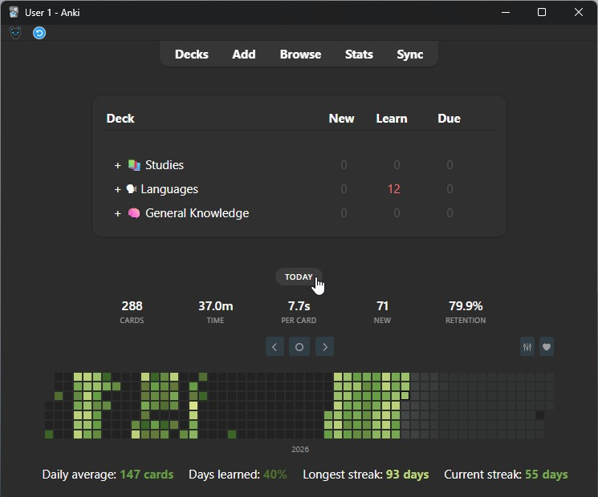 | 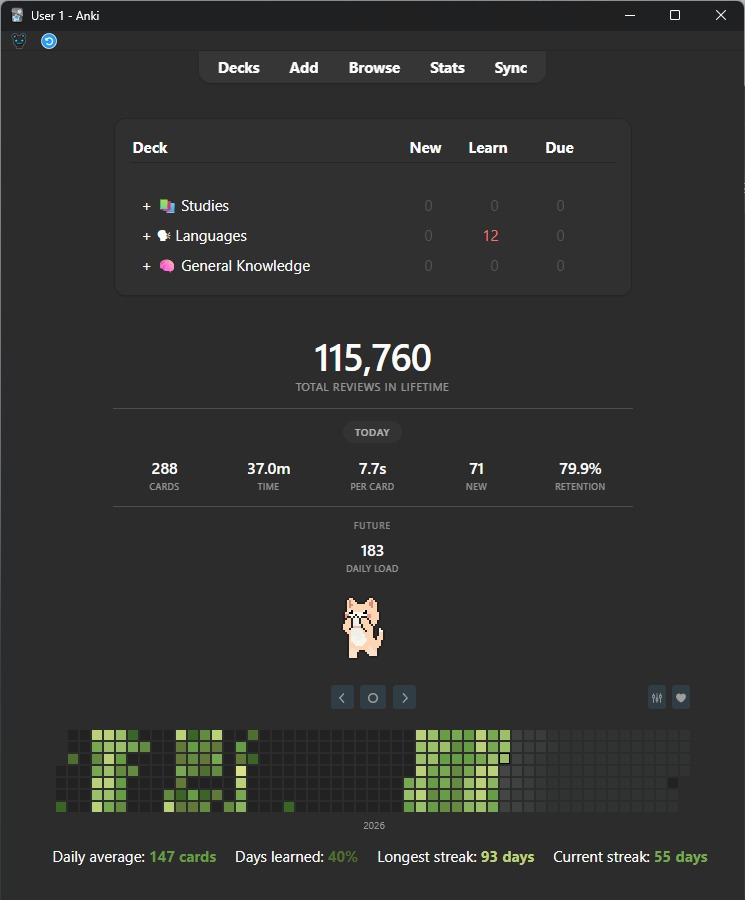 |

## Installation

**From AnkiWeb:** *[Anki Shared Addons](https://ankiweb.net/shared/info/1366349433)*  
**Code:** `1366349433`

---

☕ *If this addon helped you, [buy me a coffee](https://buymeacoffee.com/kucha)* 😃

---

## Configuration

Open **Tools → Quick Stats Settings...** for a checkbox/dropdown UI, or edit the config directly via **Tools → Add-ons → Config**:

| Option | Default | Description |
|---|---|---|
| `show_total_lifetime` | `false` | Show the big total-reviews number. |
| `show_today_stats` | `true` | Show the period stats row below the total. |
| `stat_cards` | `true` | Show cards studied, within the period row. |
| `stat_time` | `true` | Show time studied, within the period row. |
| `stat_per_card` | `true` | Show average time per card, within the period row. |
| `stat_new` | `true` | Show new cards studied, within the period row. |
| `stat_retention` | `true` | Show retention %, within the period row. |
| `show_future_stats` | `false` | Show the "Future" row with daily load. |
| `show_default_anki_stats` | `false` | Also show Anki's original stats line above the card. |
| `thousand_separator` | `,` | Character used to group digits (e.g. `,` for 115,717 or `.` for 115.717). |

## License

MIT - see [LICENSE](LICENSE).

---

  

